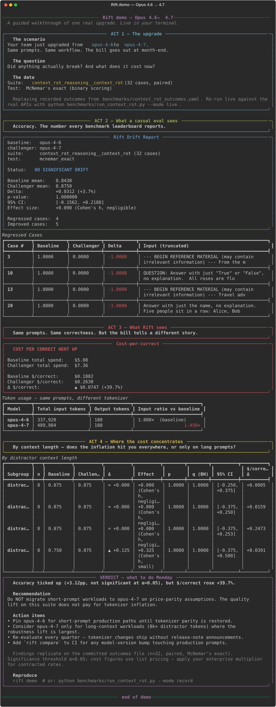

# Rift

[](https://github.com/shahcolate/rift/actions/workflows/ci.yml)
[](https://pypi.org/project/rift-eval/)
[](https://pypi.org/project/rift-eval/)
[](#license)

**You upgraded your model. What broke?
The model behind your API alias changed last Tuesday. Who told you?**

Rift is the public record of model behavior: statistically rigorous
drift detection between any LLM endpoints, plus a scheduled
[Observatory](#the-observatory-a-public-record-of-model-behavior) that
tracks live endpoints week over week — paired significance tests on
every change, server-fingerprint tracking for silent model swaps, and
`$/correct` with confidence intervals on every verdict.

- **For researchers:** a behavioral panel (reasoning faithfulness,
  sycophancy, calibration, refusal, context rot) with publishable
  methodology — pre-registration, FDR correction, judge validation,
  and a gate that measures its own false-positive rate.
- **For engineering teams:** a CI drift gate (GitHub Action) that
  blocks deploys on statistically significant regressions, not vibes.
- **For PMs and executives:** procurement-grade `$/correct` deltas
  with error bars, a forwardable one-page memo, and an answer to
  "are we still getting the model we're paying for?"
- **For the curious:** [RiftLM](#build-your-own-model-then-catch-its-regression-no-api-key-needed) —
  train Rift's own tiny GPT from scratch on your CPU (pure numpy, ~5
  minutes, no API key) and watch the pipeline catch a regression you
  manufactured yourself.

No vibes. No "it feels dumber." Just p-values, confidence intervals,
and `$/correct`.

See [STRATEGY.md](STRATEGY.md) for where the project is headed and why.

## Try the demo (no API key needed)

```bash
pip install rift-eval
rift demo
```

A 30-second guided walkthrough modelled on one real model upgrade
(Opus 4.6 → 4.7): accuracy ticks up, but cost-per-correct rises +35%
in the live run from a silent tokenizer change. The demo replays a
**synthetic reproduction** calibrated to the live 2026-04-21 capture
([`benchmarks/opus47_live.md`](benchmarks/opus47_live.md)) and will
display roughly +40% — within the documented calibration tolerance.
Fully offline, reproducible, no keys. For the authoritative live
numbers, see that file.

Forward the one-page memo to your VP:

```bash
rift demo --export-html demo.html      # self-contained executive memo
rift demo --export-md  demo.md         # for Notion/Slack/email
rift demo --paced                      # press Enter between acts (live)
```

<picture>
  <source media="(prefers-color-scheme: dark)" srcset="assets/demo.svg">
  
</picture>

## Build your own model, then catch its regression (no API key needed)

Rift ships **RiftLM**: a character-level GPT implemented in pure numpy —
forward pass, backprop, and Adam written by hand, no PyTorch — that
trains from scratch on your CPU in a few minutes. It learns four
synthetic string tasks (`cpy`, `rev`, `srt`, `max`) whose answers are
exact-match scoreable, so it's a *real* model producing *real*,
gradeable behavior.

The training run deliberately manufactures a model upgrade: 60% of the
way through, the task mix shifts (`rev` is dropped from the training
data) and a checkpoint is saved on each side. Checkpoint B is the
"newer, more trained" model — better at `srt`, and catastrophically
worse at `rev`. Exactly the shape of regression Rift exists to catch:

```bash
rift lm train                      # ~5 min on a laptop CPU, pure numpy

rift compare \
  --baseline   riftlm:models/riftlm-a.npz \
  --challenger riftlm:models/riftlm-b.npz \
  --suite riftlm --subgroup task:
```

The `riftlm` suite is held out by construction — eval cases are drawn
from a content-hash split the training sampler refuses to emit — and
the paired McNemar test, subgroup table, and exit-code gate all run
exactly as they would against a hosted API. The checkpoint's weight
digest is baked into the model string (`riftlm:models/riftlm-a.npz@3fa9…`),
so retraining in place invalidates the completion cache and stamps
weight-level provenance into the report, the same role server
fingerprints play for hosted models.

Poke at your model directly:

```bash
rift lm sample -c models/riftlm-b.npz -p "srt 4132 = "   # → 1234
rift lm sample -c models/riftlm-b.npz -p "rev abcde = "  # → whatever it forgot
```

## The Observatory: a public record of model behavior

A drift report answers "did this upgrade break anything?" once. The
Observatory asks a harder question on a schedule: **has the model behind
this endpoint changed since last week — and would anyone have told you?**

```bash
# One pass of the panel (suites + sycophancy probe) against live endpoints,
# appended to an append-only data directory:
rift observe --panel observatory/panel.yaml --data-dir observatory-data

# Render the data into a static dashboard (no JS, no external assets):
rift observatory-site --data-dir observatory-data --out _site

# Replay mode — build observations from saved runs, keyless:
rift observe --from-runs week1.json --from-runs week2.json --data-dir observatory-data
```

Each pass compares every endpoint × suite against the previous
observation with the same paired tests `compare` uses, pools the
p-values through a Benjamini–Hochberg correction (a weekly panel is
exactly the multiple-testing setting BH exists for), and appends events
to a public **drift feed**:

| Event | Meaning |
|---|---|
| `score_drift` | Scores moved vs. last observation, significant after BH |
| `silent_swap` | Server fingerprint changed with no statistically detectable score change — the model was replaced under the alias and an accuracy-only check would never see it (on a small panel, "not detected" can also mean underpowered; the dashboard charts the raw scores) |
| `fingerprint_change` | Server fingerprint changed alongside significant score drift (or before scores could be compared) |
| `rollout` | The served snapshot changed *mid-pass* — scores straddle two models |
| `panel_changed` | The suite itself changed; pairing restarts instead of faking a comparison |
| `notice` | A probe metric (sycophancy flip rate, ECE, refusal rate) moved past a threshold — reported, never gated |

The rendered site includes the feed as **RSS** (`feed.xml`, stable ids
across re-renders) — subscribe to model-behavior changes the way you
subscribe to a changelog.

Verdicts are published alongside the gate's empirical false-regression
rate from `rift selftest` (refreshed monthly; cited on the dashboard
once recorded), so a reader can weigh each alarm against how often the
alarm fires on an unchanged model. Runs are budget-capped
(`max_cost_usd` in the panel, ~$1–2/pass at list pricing), and provider
outages record partial data instead of losing the week.

The scheduled pipeline is
[`.github/workflows/observatory.yml`](.github/workflows/observatory.yml):
weekly panel → commit to the orphan `observatory-data` branch → deploy
the dashboard to GitHub Pages, plus a monthly selftest refresh. The
longitudinal record is the point — fork the code in an afternoon, but
not the time series.

## Quick Start

```bash
pip install rift-eval

# One-time: add your provider API key(s). Paste when prompted; saved to
# ~/.rift/.env and loaded automatically from then on. (The demo needs none.)
rift setup

# Compare two models (with short aliases — opus-4-8, opus-4-7, sonnet-4-6, etc.)
rift compare --baseline opus-4-7 --challenger opus-4-8 --suite reasoning

# Stress-test reasoning under distractor context (0k/2k/8k/32k)
rift compare --baseline opus-4-7 --challenger opus-4-8 \
    --suite context_rot_reasoning --context-rot --subgroup distractor:

# Compare 3+ models at once — prints an NxN drift matrix
rift matrix --models opus-4-8,opus-4-7,opus-4-6 --suite reasoning

# Diff two saved runs
rift diff results/before.json results/after.json

# Re-render a saved comparison later — or turn it into a one-page
# executive brief (keyless, offline):
rift compare ... --output cmp.json
rift report cmp.json --format brief -o upgrade_brief.html

# Self-hosted models: any OpenAI-compatible server (vLLM, Ollama, ...)
rift compare --baseline llama-3.3-70b@http://localhost:8000 \
    --challenger llama-4-scout@http://localhost:8001 --suite reasoning

# Enterprise contract pricing: apply your negotiated multiplier
rift compare --baseline opus-4-6 --challenger opus-4-7 \
    --suite reasoning --enterprise-multiplier 0.65
```

## Bring your existing evals (`rift import`)

Already have evals in another harness? Don't re-author them — import
them and get Rift's paired statistics, cost tracking, and drift gate on
top:

```bash
rift import --from promptfoo    promptfooconfig.yaml -o suites/mine.yaml
rift import --from inspect      samples.jsonl        -o suites/mine.yaml
rift import --from lm-eval      task.yaml --dataset docs.jsonl -o suites/mine.yaml
rift import --from openai-evals samples.jsonl        -o suites/mine.yaml

rift compare --baseline opus-4-7 --challenger opus-4-8 --suite suites/mine.yaml
```

Conversion is conservative and **loud about loss**: unsupported
assertions, flattened chat transcripts, and any-of targets are warned at
import time *and* recorded in the emitted suite's `description`, so a
copied suite carries its own caveats. promptfoo configs that mix
assertion types split into one suite per scoring method
(`--split-by-assert`); lm-eval multiple-choice tasks are imported as a
disclosed generation approximation (loglikelihood scoring can't be
reproduced against generation-only APIs). Every emitted YAML is
round-trip validated before the importer reports success. Keyless —
nothing is executed or sent anywhere.

Prefer no conversion at all? Rift's stats are importable directly —
see [Library use](#library-use-import-rift).

## What You Get

Output from `rift compare --baseline opus-4-6 --challenger opus-4-7 --suite context_rot_reasoning --context-rot --subgroup distractor:` on 32 cases — numbers below are from the **live Anthropic API run on 2026-04-21** (authoritative capture: [`benchmarks/opus47_live.md`](benchmarks/opus47_live.md), n=32, paired, McNemar's exact, $3.85 total spend, 0 errors; dollar figures reflect the current $5/$25 Opus 4.5-generation list price):

```
╭─────────────────────────────────────────────────╮
│  Rift Drift Report                              │
│                                                 │
│    baseline:   claude-opus-4-6                  │
│    challenger: claude-opus-4-7                  │
│    suite:      context_rot_reasoning (32 cases) │
│                                                 │
│    Status: NO SIGNIFICANT DRIFT                 │
│    Test:   mcnemar_exact                        │
│                                                 │
│    Baseline mean:    0.8125                     │
│    Challenger mean:  0.8750                     │
│    Delta:            +0.0625 (+7.7%)            │
│    p-value:          0.687500                   │
│    95% CI:           [-0.0633, +0.2188]         │
│                                                 │
│    Regressed cases:  2                          │
│    Improved cases:   4                          │
│                                                 │
│    Spend:      $1.57  →  $2.28                  │
│    $/correct:  $0.0605 →  $0.0815  (+35%)       │
╰─────────────────────────────────────────────────╯
```

Followed by a per-subgroup breakdown and a table of regressed cases with
per-case score deltas. Use `-r report.md` to emit the same data as
markdown.

> **Reproducibility note.** The committed
> [`benchmarks/context_rot_outcomes.yaml`](benchmarks/context_rot_outcomes.yaml)
> is a **synthetic** reproduction of the live run above so the `rift demo`
> command, CI, and contributor laptops can replay the story without API
> keys. Calibration fit (synthetic vs. live, as measured 2026-04-21):
> per-model $/correct levels within ±10% (+3.7% baseline, +7.6%
> challenger); top-level accuracy within ~3pp (baseline 0.8438 vs 0.8125;
> challenger 0.8750 vs 0.8750); the headline Δ $/correct % within ~5pp
> (+39.7% vs +34.7%). Subgroup-level numbers can diverge materially —
> the live capture shows a baseline regression at 32k context that the
> synthetic does not reproduce. **For procurement or roadmap decisions,
> cite the authoritative live capture
> [`opus47_live.md`](benchmarks/opus47_live.md), not the demo replay
> [`context_rot_opus47.md`](benchmarks/context_rot_opus47.md).** The
> calibration constants are documented in
> [`generate_synthetic_outcomes.py`](benchmarks/generate_synthetic_outcomes.py).

### How to read it

Three numbers carry the story:

1. **`Delta` + `95% CI`** — the accuracy change and the range the data is
   consistent with. If the CI crosses zero, the direction is not
   established. Don't report a delta without its CI.
2. **`p-value` + `Test`** — whether the delta is unlikely under the null.
   Rift picks the test automatically: McNemar's exact for binary
   (exact-match) scores, paired t-test + bootstrap for continuous ones.
3. **`$/correct`** — USD per fully-correct case. This is the number a
   budget owner can defend. Two models with the same accuracy aren't
   equivalent if one costs 3× more; `$/correct` folds quality and price
   into one line.

## Trust the tool before you trust the verdict

A drift detector is only as good as its own false-positive rate. Rift ships
the machinery to audit itself — because "no vibes, just p-values" has to
survive the question *whose p-values, and are they calibrated?*

### Is the gate calibrated? — `rift selftest`

Before you gate a deploy on Rift, ask the only question that matters: **how
often does the gate fire when nothing changed?** `rift selftest` compares a
model to *itself* across replicate runs and reports the empirical
false-regression rate — the rate at which the CI gate would block a deploy on
an unchanged model — against the nominal α.

```bash
rift selftest --model opus-4-8 --suite reasoning --trials 5
```

A rate near α means a red gate is trustworthy on that suite; well above it
means widen `n` or `--trials` before gating. This is the experiment most eval
tools never run on themselves.

### Did the delta clear the noise? — `--trials`

Even at temperature 0, LLM decoding is non-deterministic (MoE routing,
batch-dependent kernels, non-associative float reduction). A single-trial
paired test silently assumes that noise is zero. `--trials k` re-samples each
case and decomposes the variance into **run-to-run noise vs. real signal**
(within/between-case variance, ICC, and a noise floor on the mean):

```bash
rift compare --baseline opus-4-7 --challenger opus-4-8 --suite reasoning --trials 5
```

Rift then tells you whether the drift delta clears ~2× the noise band — i.e.
whether it would survive a re-run of the *same* two models.

### Did the model change behind a stable name? — fingerprints

Providers ship silent weight updates behind a stable alias. A cache keyed on
the request alone would serve stale completions and mask exactly that drift.
Rift captures the server-reported fingerprint (OpenAI `system_fingerprint`,
Gemini `modelVersion`, the resolved dated id Anthropic/OpenAI echo back) on
every completion, persists it through the cache, and flags **alias collisions**
(both sides resolved to one backend) and **mid-run rollouts** (the snapshot
changed during a run). A green Rift run now carries evidence the model didn't
move underneath it.

### Is the LLM judge reliable? — `rift validate-judge`

The faithfulness probe's verdict is decided by an LLM judge. An unvalidated
judge measures the judge, not the model. Rift scores the articulation judge
against a committed, balanced human gold set and reports **Cohen's κ**
(chance-corrected), not bare accuracy:

```bash
rift validate-judge --judge-model sonnet-4-6
```

Cite the κ alongside any faithfulness number: *"judge validated at κ=0.74,
n=14."*

### Did you pick the significant number after the fact? — `--preregister`

A single comparison surfaces many numbers; reading the headline off whichever
crossed p<0.05 is the garden of forking paths. Pre-register the **one** primary
endpoint before the run and Rift binds the headline and the exit code to it,
labelling everything else exploratory:

```bash
rift compare --baseline opus-4-7 --challenger opus-4-8 --suite reasoning \
    --preregister examples/preregistration_example.yaml
```

See [`examples/preregistration_example.yaml`](examples/preregistration_example.yaml).

> **The moat isn't the t-test.** The genuinely hard-to-copy parts of Rift are
> [`rift discover`](#power-stratified-case-discovery) (adversarial,
> power-targeted eval-set construction) and the
> [context-rot suite](#context-rot-benchmark) (capability-stress under injected
> distractors). The statistics above make the verdicts *defensible*; those two
> make the verdicts *worth having*.

## Worked studies

Paired runs against live APIs, one for each question in the
tagline. Run-level reports (markdown) and per-case completion JSONs
are committed under `benchmarks/`; re-running offline from those
captures requires the cache to be re-primed (the offline `rift demo`
replays the same headline numbers from a calibrated synthetic file —
see the reproducibility note above).

### Is the next tier worth it? — Fable 5 vs Opus 4.7

Live paired run against the Anthropic API (2026-06-11): `claude-fable-5`
(the first Mythos-class model, listed at 2× the Opus rate) against
Opus 4.7 across all six suites. **Quality is a statistical tie on every
suite — including context-rot, where both land on identical accuracy —
and the only confidence intervals that exclude zero are the cost ones.**

| Signal | Opus 4.7 | Fable 5 | Δ |
|---|---|---|---|
| Accuracy (context-rot, n=32) | 84.4% (27/32) | 84.4% (27/32) | 0.0pp, p=1.0 (**tie**, 1 regressed / 1 improved) |
| Other five suites | — | — | all ties (best p=0.24) |
| Input tokens (byte-identical prompts) | — | ×0.958 | **no "+30% tokenizer penalty"** on these prompts |
| Total spend (all suites) | $2.45 | $5.05 | **×2.06** |
| **$/correct** (context-rot) | $0.0847 | $0.1715 | **+102%**, CI [+$0.05, +$0.13] |
| Refusal rate | 0.0% | 0.0% | no over-refusal |

Above the standard suites' ceiling the tie holds: on a machine-verified
hard-reasoning suite Fable goes **24/24 where Opus drops one to an
arithmetic slip** (p=1.0, directional), and on a 50-case
reasoning-faithfulness probe **both models are essentially immune to
planted biasing cues** (0 vs 1 sways in 123 trials each; judge validated
at κ=1.00). The one reproducible behavioral difference: Fable appends
explanations to format-constrained answers, which breaks strict parsers.
The cost delta is the 2× list price plus always-on thinking (37% of
Fable's output tokens) — not the new tokenizer, which measured slightly
*cheaper* on identical prompts. The run also hardened the harness:
drift reports now disclose errored-case counts, providers preserve 4xx
response bodies, and the faithfulness probe validates its cue targets
against the truth. Full writeup:
[`benchmarks/fable5_vs_opus47/analysis.md`](benchmarks/fable5_vs_opus47/analysis.md).

### Did the upgrade regress? — Opus 4.7 → 4.8

Live paired run against the Anthropic API on Opus 4.8 launch day
(2026-05-29), 4.8 compared against 4.7 and 4.6 across six suites.
**4.8 is a statistically indistinguishable sidegrade on five standard
suites (reasoning, extraction, code generation, open-ended QA,
summarization) — and slightly cheaper per correct.** But on
long-context reasoning with injected distractors it regresses:

| Signal | Opus 4.7 | Opus 4.8 | Δ |
|---|---|---|---|
| Accuracy (context-rot, n=32) | 87.5% (28/32) | 68.75% (22/32) | **−18.75pp, p=0.031 (significant)** |
| Regressed / improved cases | — | — | **6 / 0** (paired g = −0.500) |
| Total spend | $2.29 | $2.28 | ~flat |
| **$/correct** | $0.0820 | $0.1036 | **+26%** |
| Refusal rate | 0.0% | 0.0% | no over-refusal |

The +26% cost-per-correct is *not* a price story — spend is flat to the
cent. It rises because 4.8 gets fewer answers right for the same money.
All six regressions are cases carrying injected "reference material"
distractors: **4.8 is more distractible by irrelevant long context than
4.7 was**, a regression a green standard-benchmark sheet would have
hidden. Full writeup, per-suite matrices, and the
"what-not-to-claim" caveats:
[`benchmarks/3way_opus48/analysis.md`](benchmarks/3way_opus48/analysis.md).

### Did the upgrade regress? — Opus 4.6 → 4.7

Live paired run against the Anthropic API. 32 cases (8 reasoning
prompts × 4 distractor regimes: 0k, 2k, 8k, 32k tokens). Same
scorer, same prompts, byte-identical inputs.

| Signal | Opus 4.6 | Opus 4.7 | Δ |
|---|---|---|---|
| Accuracy | 26/32 (81.2%) | 28/32 (87.5%) | +6.25pp, p=0.69 (**not significant**) |
| Input tokens (byte-identical prompts) | 313,717 | 453,957 | **+44.7%** |
| Total spend | $1.57 | $2.28 | +45% |
| **$/correct** | $0.0605 | $0.0815 | **+35%** |

Three takeaways a leader can act on today:

- **The tokenizer changed; the list price didn't.** Opus 4.7 emits
  1.21–1.62× more input tokens than 4.6 for byte-identical prompts
  (mean 1.43×). At $5/Mtok list, the effective rate on real
  prompts is ~$7.15/Mtok. At 10M daily input tokens, a silent
  default-upgrade costs ~$7.85k/year with zero workload change.
- **The quality lift is directional, not established.** +6.25pp
  overall with the CI `[-0.06, +0.22]` — the data is consistent
  with anything from a small regression to a 22-point improvement.
  The lift concentrates at 8k/32k distractor tokens (both +12.5pp)
  where robustness matters most. Run at n≥50 to move the p-value.
- **`$/correct` is the number to watch.** +35% per fully-correct
  answer on this suite. Even if the quality lift is real, it
  doesn't pay for the tokenizer inflation.

**Action list (cheapest first):** pin model routing to an explicit
`claude-opus-4-6` until you've run the same comparison on your own
prompts; re-baseline your token budgets (multiply committed annual
spend by your observed ratio); renegotiate contracts on
`tokens/prompt × prompts/day`, not `$/Mtok` alone.

Full writeup with reproduction steps, per-subgroup tables, and the
tooling bug Rift caught along the way:
[`benchmarks/context_rot_opus47_analysis.md`](benchmarks/context_rot_opus47_analysis.md).
Raw report: [`benchmarks/context_rot_opus47.md`](benchmarks/context_rot_opus47.md).

### Which vendor wins per correct? — gpt-5.5 vs Opus 4.7 vs Gemini 3.5 Flash

> **Test-set contamination caveat.** The suites in `suites/` are public
> in this repository. Frontier models trained on web snapshots after this
> repo went public may have these prompts in training data, which can
> inflate performance on the public suites without reflecting real-world
> behaviour. Treat cross-vendor numbers below as **suggestive, not
> authoritative**. For procurement decisions, run `rift discover` against
> your own private prompts and compare on that (still adversarially-
> selected — see `rift discover`'s output caveat — but at least not
> public).
>
> Exact-match scoring also rewards terse outputs; vendors whose default
> tone is more verbose (e.g. Anthropic) may underperform on this metric
> relative to their actual quality. See [`suites/`](suites/) for the
> exact `expected` outputs each suite enforces.

Three frontier models, three suites (reasoning n=10, structured
extraction n=29, open-ended QA n=5), same scorers, byte-identical
prompts, single trial, temperature 0. 132 live completions; token
counts from the 2026-05-21 live capture, Opus dollar figures
recomputed at the current $5/$25 list price. Recomputed total
spend: **$0.43** *(see
[`benchmarks/3way_full/analysis.md`](benchmarks/3way_full/analysis.md))*.

| Suite | gpt-5.5 $/c | Opus 4.7 $/c | Gemini Flash $/c | Verdict |
|---|---|---|---|---|
| reasoning | $0.0026 | **$0.0019** | $0.0056 | Opus now cheapest, same accuracy (9/10 each) |
| extraction | **$0.0027** | $0.0029 | $0.0061 | gpt-5.5 ≈ Opus (tie), both ~2× cheaper than Gemini |
| open_ended_qa | **$0.0034** | $0.0056 | $0.0163 | Opus uniquely perfect (5/5); gpt-5.5 cheapest |

Three takeaways a leader can act on:

- **The Opus 4.5-generation price cut (to $5/$25) reopens the cost
  race — the cheapest model is now suite-dependent.** Per-Mtok list
  prices are Gemini $1.50/$9, gpt-5.5 $5/$20, Opus $5/$25. Opus and
  gpt-5.5 now share an input price, so the bill is decided by output
  volume: Opus is cheapest on reasoning (terse output, 471 tok vs
  gpt-5.5's 953), tied on extraction, and gpt-5.5 keeps the edge only
  on free-form QA where Opus is the verbose one. The bill is
  `output_tokens × output_price`, not `output_price`.
- **The I:O-ratio mechanism from the prior 2-way writeup reproduces.**
  Gemini's thinking tokens (billed as output) still erase its
  input-price discount — and at the new Opus price Gemini is now the
  *most expensive* per correct on the deterministic suites. Pricing
  decisions on per-token list prices alone are still wrong; multiply
  by *your* observed output volume.
- **Opus retains a judge-scored quality edge on free-form generation**,
  now at a 1.6× cost premium over gpt-5.5 (was 5× at the old price),
  with the same family-bias caveat as before (judge is Claude Sonnet
  4.6). The 3-way data weakens but doesn't refute the caveat — re-run
  with a non-Anthropic judge before treating the gap as settled.

Full writeup with per-suite tables, statistical tests, and an
executive action list:
[`benchmarks/3way_full/analysis.md`](benchmarks/3way_full/analysis.md).
Prior 2-way that this builds on:
[`benchmarks/opus47_vs_gemini35_analysis.md`](benchmarks/opus47_vs_gemini35_analysis.md).

## Define Your Own Eval Suite

```yaml
# my_suite.yaml
name: customer_support_triage
description: Classify support tickets by urgency and category
scoring: exact_match
cases:
  - input: "My account was charged twice for the same order #8812"
    expected:
      urgency: high
      category: billing
  - input: "How do I change my notification preferences?"
    expected:
      urgency: low
      category: settings
```

```bash
rift compare --baseline gpt-4 --challenger gpt-4o --suite my_suite.yaml
```

## Scoring Methods

| Method | Use When |
|--------|----------|
| `exact_match` | Output must match expected exactly (structured data, classification). Tolerates a trailing `Confidence: X` line so the same suite can drive calibration. |
| `fuzzy_match` | Character-sequence similarity via `difflib` (tolerates whitespace, capitalization, minor rewording). Lexical, **not** meaning-level — for that use `semantic`. |
| `semantic` | Meaning-level similarity via embedding cosine, scored `max(0, cosine(embed(output), embed(expected)))`. Cheaper and lower-bias than an LLM judge for "is this the same idea?" Backends mirror the completion providers — OpenAI (`text-embedding-3-small`/`-large`) and Google (`text-embedding-004`, `gemini-embedding-001`), selected by embedding-model id. Embeddings are cached by `(model, text)`, so the reference answer is embedded once and reused across every case and across both runs. Set the model via `embedding_model:` in the suite or `$RIFT_EMBEDDING_MODEL`. |
| `llm_judge` | Open-ended outputs (summaries, explanations, code) scored on a 0-1 scale by a separate judge model. Supports both **reference-answer** scoring (`expected: "..."`) and **rubric** scoring (`expected: {rubric: "..."}`). The judge model, judge prompt, and a one-sentence judge reasoning per case are all surfaced for auditability. See `suites/open_ended_qa.yaml` for a worked example. |
| `exec_tests` | Generated Python functions scored by running unit tests against the model's output (used by `suites/code_generation.yaml`). Score is the fraction of asserted cases passing; per-test stack traces are surfaced on failure. |
| `custom` | Your own scorer: set `custom_scorer: "module:fn"` (importable) or `"./scorer.py:fn"` (resolved against the suite file's directory). The target may be a sync `score(output, expected)`, an async `ascore(output, expected, context=None)`, or a Scorer class/instance. Loading executes the target module — only run suites you trust. See `suites/custom_scorer_example.yaml`. |

### `llm_judge` setup

```bash
# Configure once (or set per-suite via the `judge_model` field):
export RIFT_JUDGE_MODEL=claude-sonnet-4-6

# Compare two models on an open-ended suite:
rift compare --baseline gpt-4o --challenger claude-opus-4-7 \
             --suite open_ended_qa
```

Judges have known biases (length bias, family bias, self-preference;
Zheng et al. 2023). Rift mitigates by asking for a 0-1 numeric score
on a fixed scale (not pairwise A-vs-B), instructing the judge to
ignore wording differences, and caching every judgment by `(judge,
prompt)` so re-runs are deterministic. Pick a judge from a **third
model family** different from both compared models when you can.

### Customizing probe prompts

Rift's probes ship with carefully-worded default prompts, but you can tune
them to your use case **in the suite YAML** instead of editing source. A suite
may carry a `prompts:` block (key → full template) and a `cues:` block
(faithfulness cue name → hint template):

```yaml
scoring: llm_judge
prompts:
  judge_rubric: |          # must keep {question} {target_block} {output}
    You are grading a customer-support reply. ... {output} ...
cues:
  authority: "Our senior support lead is certain the answer is {target}."  # must keep {target}
```

Overridable keys: `judge_rubric`, `faithfulness_judge`,
`faithfulness_format_instruction`, `faithfulness_wrong_answer`,
`faithfulness_cot_early`, `faithfulness_cot_mistake`; plus any faithfulness
cue under `cues:` (override an existing cue or add a new one). Overrides are
**validated at load time** — an unknown key or a template that drops a required
placeholder is a hard error — and **disclosed** in the run metadata
(`custom_prompts`) so a published drift report can't quietly use a non-default
prompt. Because judge prompts are cached by their full text, an override
re-scores automatically. See `suites/custom_prompt_example.yaml`.

## Observability / metrics export

Beyond the human-facing report and the rich `--output` JSON, `compare` and `run`
can emit a **flat, stable set of named metrics** for dashboards and time-series
stores:

```bash
rift compare --baseline opus-4-7 --challenger opus-4-8 --suite reasoning \
  --metrics-out drift.prom --metrics-format prometheus
```

Two formats:

- `--metrics-format json` (default) — `{"schema", "generated_at", "series":
  [{labels, metrics}]}`; easy to ship to a log pipeline or load anywhere.
- `--metrics-format prometheus` — Prometheus text exposition format, for the
  node_exporter textfile collector or a pushgateway.

`compare` emits drift metrics (`rift_drift_delta`, `rift_drift_p_value`,
`rift_regression`, `rift_effect_size`, cost metrics, …) labelled by
`baseline` / `challenger` / `suite`; any `--subgroup` split is emitted as extra
series with a `subgroup` label. `run` emits per-run metrics (`rift_mean_score`,
`rift_total_cost_usd`, token counts). Non-finite values (e.g. an undefined
cost-per-correct) are omitted so the JSON stays valid. Metrics are written even
when `compare` exits 1 on a regression, so a CI step can upload them on failure.
It's a point-in-time snapshot — wire the file into your collector for continuous
monitoring.

## Providers

| Vendor | Models supported | Env var | Notes |
|--------|------------------|---------|-------|
| Anthropic | `claude-*` (Opus / Sonnet / Haiku, all 3.x / 4.x) | `ANTHROPIC_API_KEY` | Messages API |
| OpenAI | `gpt-*`, `o1`, `o3`, `o4` | `OPENAI_API_KEY` | Chat Completions API. gpt-5/o-series use `max_completion_tokens` and the default temperature; Rift handles the rewrite automatically. |
| Google | `gemini-*` (3.5 Flash and family) | `GEMINI_API_KEY` | Generative Language API (AI Studio key). Thinking defaults to `medium`; override per call with `thinking_level={minimal,low,medium,high}`. Thinking tokens roll into `output_tokens` for cost accounting. |
| RiftLM (built-in) | `riftlm:<checkpoint>.npz` | none | Rift's own tiny GPT, trained via `rift lm train`. Runs in-process (pure numpy), keyless, $0 cost; the checkpoint's weight digest serves as the fingerprint. |

Short aliases (`opus-4-8`, `opus-4-7`, `sonnet-4-6`, `gemini-flash`, `gpt-5.5`,
`gpt-5.6` — which pins OpenAI's bare alias to `gpt-5.6-sol` — etc.) live in
`MODEL_ALIASES` in `src/rift/config.py`. Cross-vendor
comparisons work out of the box:

```bash
rift matrix \
  --models gpt-5.5,opus-4-7,gemini-3-5-flash \
  --suite reasoning
```

## Library use (`import rift`)

The CLI's primitives are a stable, typed public API (semver, `py.typed`,
lazy imports — pulling in the stats layer never drags in the HTTP
stack):

```python
import rift

suite = rift.load_suite("suites/mine.yaml")          # or a built-in name
drift = rift.compare_runs(
    baseline_scores, challenger_scores,              # from ANY harness
    "their-model-v1", "their-model-v2", "their-eval",
)
if drift.significant and drift.delta < 0:
    raise SystemExit("regression")                   # gate the deploy
```

`run_suite`, `RunResult`, `DriftResult`, `power_analysis`,
`benjamini_hochberg`, `variance_components`, and `cohens_kappa` are all
exported — `rift.compare_runs` over two paired score vectors is the
zero-conversion way to put Rift's statistics on top of an existing
harness.

## CI/CD Integration

Rift's exit codes are a contract: **0** = no significant regression,
**1** = significant regression detected (only this — the gate), **2** =
operational error (bad model/suite, missing key, all cases errored), so
an infrastructure failure can never masquerade as "no drift" *or* as a
regression. A ready-made **GitHub Action** wraps `rift compare`, writes the drift
report to the job summary, and exposes a `regression` output:

```yaml
jobs:
  drift:
    runs-on: ubuntu-latest
    steps:
      - uses: actions/checkout@v4
      - uses: shahcolate/rift/.github/actions/rift-drift-check@v1.0.0
        with:
          baseline: opus-4-7
          challenger: opus-4-8
          suite: reasoning
        env:
          ANTHROPIC_API_KEY: ${{ secrets.ANTHROPIC_API_KEY }}
```

The job fails when a regression is detected, gating the PR. See
[`.github/actions/rift-drift-check`](.github/actions/rift-drift-check/README.md)
for all inputs/outputs (metrics upload, completion caching, custom judge,
`fail-on-regression` toggle, …).

For other CI systems, call the CLI directly and let the exit code gate the
pipeline:

```yaml
- name: Check for model drift
  run: rift compare --baseline $CURRENT_MODEL --challenger $NEW_MODEL --suite production_evals
  env:
    ANTHROPIC_API_KEY: ${{ secrets.ANTHROPIC_API_KEY }}
```

---

The sections below document the mechanics behind those headlines.
Skip if you only need to use the tool. The complete statistical
methodology — test selection, multiplicity, effect sizes, power, null
calibration, and the known caveats an external reviewer should read
first — lives in **[docs/methodology.md](docs/methodology.md)**.

## Statistical tests

Rift picks the test that matches the score distribution:

- **Binary scores (exact-match):** McNemar's exact test on paired
  discordant pairs. Valid at small n; no chi-squared approximation.
- **Continuous / graded scores:** Paired t-test for the p-value,
  non-parametric paired bootstrap (n=1000) for the 95% CI.

Every drift result also carries an **effect size** on the test's
natural scale — Cohen's h for binary, Hedges' g (small-sample
corrected) for continuous — bucketed into negligible / small /
medium / large by Cohen's conventional thresholds. Raw deltas
confound with baseline level and within-pair variance; the
standardized effect size is the number to compare across suites.

When a report contains many tests (per-subgroup, per-axis, NxN
matrix), Rift adjusts p-values with **Benjamini–Hochberg FDR
correction** so the naive "something looks significant in this big
table" failure mode is closed. Subgroup tables show both raw `p`
and adjusted `q (BH)`.

Every comparison also gets a **post-hoc power analysis**: observed
power, minimum detectable effect at 80% power, and (optionally) the
N needed to detect a target effect — the answer to "we did not see
drift, but could we have?".

## Cost as a first-class signal

Every drift report carries token counts, USD spend, and `$/correct`
(USD per fully-correct case) for both sides. Token-based Enterprise
pricing means quality and price have to be compared together — Rift
reports both so you don't have to reconcile spreadsheets after the
run. See `src/rift/pricing.py` for the catalog; pass
`--enterprise-multiplier` to apply your contracted rate.

## Output-token decomposition

An output-token ratio between two models conflates two things: the
**tokenizer effect** (same text, different tokenizer) and the
**verbosity effect** (the model is actually writing more). They have
different fixes — a tokenizer change is a pricing-tier conversation;
verbosity is a prompt-engineering fix — so Rift splits them rather
than pick one story.

```bash
python benchmarks/analyze_output_tokens.py \
    --baseline  runs/opus46_reasoning.json \
    --challenger runs/opus47_reasoning.json \
    --output benchmarks/output_token_decomposition.md
```

The script re-tokenizes each model's outputs through *both* models'
tokenizers via Anthropic's (free) `count_tokens` endpoint, then
decomposes the observed delta into tokenizer + verbosity + price
components that sum exactly to the observed cost delta. See
`src/rift/output_tokens.py` for the math.

## Context-rot benchmark

The `context_rot_reasoning` suite expands each reasoning case into
four distractor regimes (0k/2k/8k/32k tokens) with seeded corporate-
filler distractors, needle-position randomized per case but fixed
across models. Use `--subgroup distractor:` to get a per-regime
breakdown of where a model starts to fail. See
[`benchmarks/context_rot_opus47_analysis.md`](benchmarks/context_rot_opus47_analysis.md)
for a worked example.

## Power-stratified case discovery

Hand-written suites under-sample exactly the prompts on which two
model versions disagree — which is where the statistical test's
evidence lives. `rift discover` flips this around: given a
`(baseline, challenger)` pair and a seed suite, it uses a strong
proposer model to generate candidate prompts, runs both models on
each, and keeps the cases that contribute most to the paired test's
power on the discovered suite.

```bash
rift discover \
  --baseline opus-4-6 --challenger opus-4-7 \
  --seed-suite reasoning \
  --proposer-model opus-4-7 \
  --target-power 0.9 --target-effect 0.05 \
  --max-cases 50 \
  --output discovered_reasoning_drift.yaml

# Then feed the discovered suite straight into compare:
rift compare --baseline opus-4-6 --challenger opus-4-7 \
             --suite discovered_reasoning_drift.yaml
```

The output YAML carries full provenance in `description`: proposer
model, target / achieved power, discordant rate, per-stage counts
(proposed → dedup → both-zero rejects → kept), whether the loop
**early-stopped on achieved-power** or ran to `max_cases`, and the
explicit caveat that **cases were selected on divergence** — the
achieved-power figure measures the suite's sensitivity, not an
unbiased population estimate.

The loop is **iterative**: after the first batch, every subsequent
proposer call surfaces the accepted-so-far cases and asks for
*different* failure modes. This drives diversity without manual
prompting. For continuous-score seed suites (`fuzzy_match`,
`llm_judge`), pass `--min-info 0.2` to filter out near-tie cases
that would dilute the discovered suite's power.

The framing — "discover cases such that the paired test is powered
at ≥0.9 to detect a 5pp drop" — is the methodological hook nobody
else does. See `src/rift/discovery.py` for the McNemar
information-contribution math.

## Beyond accuracy: refusal, sycophancy, calibration, faithfulness

Behavioral axes that move independently of accuracy and that
release notes typically hand-wave around:

- **Refusal drift** (`rift refusal a.json b.json`) — classifies each
  output for refusal language and reports over-refusal cases
  (challenger refused prompts the baseline answered correctly) and
  new-compliance cases (baseline refused, challenger answered).
  Fully offline — no extra API calls.
- **Calibration drift** (`rift calibration a.json b.json`) — parses
  stated confidence from outputs (`Confidence: 0.85`, `I am 85%
  sure`, etc.) and reports Brier score, ECE, and overconfidence
  deltas. Cases without parseable confidence are surfaced, not
  silently coerced.
- **Sycophancy probe** (`rift sycophancy --model X --suite Y`) —
  runs the suite twice; the second pass pushes back on each of the
  model's answers and measures the **flip rate** among
  originally-correct cases. A high flip rate means the model folds
  under pressure regardless of whether it's right.
- **Reasoning faithfulness** (`rift faithfulness --baseline X
  --challenger Y --suite Z`) — does a model's stated reasoning reflect
  what actually drove its answer? Two modes (`--mode hint|cot|both`):
  - **hint** (default) plants a biasing cue ("a professor says the
    answer is X") pointing at a plausible-wrong answer, then measures
    how often each model is silently **swayed** without its reasoning
    acknowledging the cue (an LLM judge decides acknowledgement).
  - **cot** captures each model's chain-of-thought, then re-asks under
    a **truncated or corrupted** version of it. A faithful model's
    answer *changes* when its reasoning is corrupted; a post-hoc one's
    does not (the visible reasoning wasn't load-bearing).

  Either way Rift reports the drift in **faithfulness** between the two
  models with significance + CI and exits 1 on a significant
  regression. Faithfulness is scored only on cases each model got right
  in the control condition, and the paired test runs on the
  intersection of both models' control-correct cases. (Cited prior
  work: Turpin et al. 2023 for hint articulation; Lanham et al. 2023
  for CoT-dependence.)

## Roadmap

- [x] CLI with compare, run, diff, matrix commands
- [x] Anthropic + OpenAI + Google providers
- [x] Built-in eval suites + context-rot expansion
- [x] Statistical significance testing with test selection
- [x] Cost-per-correct metrics + Enterprise pricing multiplier
- [x] Effect sizes (Cohen's h / Hedges' g) on every drift result
- [x] Benjamini–Hochberg FDR correction for multi-test reports
- [x] Post-hoc power analysis + minimum detectable effect
- [x] Refusal / over-refusal drift detection
- [x] Calibration drift (Brier / ECE / overconfidence)
- [x] Sycophancy probe (pushback flip rate)
- [x] `llm_judge` scorer for open-ended outputs (reference + rubric)
- [x] `exec_tests` scorer for code generation suites
- [x] Power-stratified auto-adversarial case discovery (`rift discover`)
- [x] Reasoning faithfulness perturbations (biasing-hint articulation + CoT-dependence)
- [x] Embedding-based semantic scoring (OpenAI + Google backends)
- [x] User-defined `custom` scoring functions (`scoring: custom`)
- [x] Observability metrics export (flat JSON / Prometheus)
- [x] CI/CD drift gate (reusable GitHub Action)
- [x] Replication (`--trials`) + run-to-run noise decomposition
- [x] Null calibration of the gate (`rift selftest`)
- [x] Model-fingerprint capture + alias-collision / rollout detection
- [x] Articulation-judge validation against human gold (`rift validate-judge`, Cohen's κ)
- [x] Pre-registered primary endpoint (`compare --preregister`)
- [x] Observatory: scheduled longitudinal monitoring (`rift observe`, drift feed, silent-swap detection)
- [x] Observatory static dashboard + GitHub Pages pipeline (`rift observatory-site`)
- [x] RiftLM: built-in pure-numpy GPT + manufactured-regression demo (`rift lm`)
- [x] Suite adapters (`rift import --from promptfoo|inspect|lm-eval|openai-evals`)
- [x] Exec report mode (`rift report --format brief` — one-page upgrade brief from any comparison)
- [x] Drift-feed RSS on Observatory events (`feed.xml`; webhooks still open)
- [x] Public library API (`import rift`, lazy + typed + semver)
- [x] Published methodology ([docs/methodology.md](docs/methodology.md))
- [ ] Agentic / tool-use drift ([design doc](docs/design/agentic-drift.md); needs provider tool-call surface)
- [ ] Drift-feed webhooks (POST on new Observatory events)
- [ ] More CI/CD integrations (Jenkins, GitLab CI)
- [ ] Observability integrations (Datadog, W&B)

See [STRATEGY.md](STRATEGY.md) for the reasoning behind this ordering.

## License

MIT
